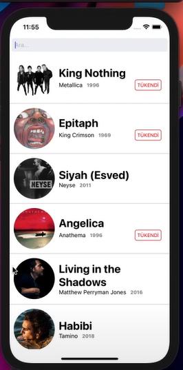

# MusicApp

Bu repo [Patika.dev](https://www.patika.dev) *MusicApp* uygulaması için oluşturduğum bir diğer repo.

## Patika.dev Hesabım
[Yunus Şükrü Gülten](https://app.patika.dev/yunussukrugulten)

## Proje Resmi


## Installation

Öncelikle projeyi clonelayın. (Buraya sizin reponuzdan aldığınız link gelecek)

```bash
git clone https://github.com/yunussukrugulten/MusicApp.git
```

## Usage

Projeyi cloneladıktan sonra Visual Studio Code programında açınız.

Linux için:
```linux
cd MusicApp
code .
```

## License

[MIT](https://choosealicense.com/licenses/mit/)